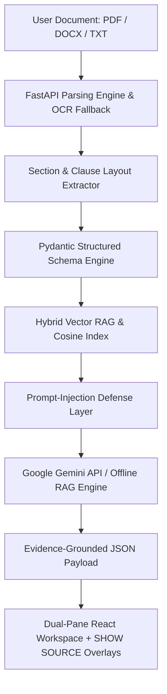

# ⚖️ NyaySetu (न्यायसेतु)
> **"Bridging Legal Complexity and Understanding."**

[](https://my-project-70303.web.app)
[](https://www.python.org/)
[](https://fastapi.tiangolo.com/)
[](https://reactjs.org/)
[](https://vitejs.dev/)
[](https://tailwindcss.com/)
[]()
[]()

NyaySetu is an India-focused, GenAI-powered legal information, document intelligence, version comparison, and consultation preparation platform engineered for the **PromptWars Virtual** challenge.

---

## 🌐 Live Global Deployment
- **Live Web Application**: **[https://my-project-70303.web.app](https://my-project-70303.web.app)**
- **GitHub Repository**: **[https://github.com/sainarayana75/NyaySetu](https://github.com/sainarayana75/NyaySetu)**

---

## 🌟 Core Product Thesis & Non-Negotiable Differentiator

### **Evidence-First Legal Understanding Platform**
Most AI legal tools force users to blindly trust a chatbot summary. **NyaySetu is different.** Every AI finding, clause summary, obligation, and Q&A answer is strictly traceable to original source text.

```
┌─────────────────┐       ┌───────────────────────┐       ┌───────────────────────┐
│  AI FINDING /   │  ──►  │   FLAGSHIP ACTION     │  ──►  │ ORIGINAL SOURCE TEXT  │
│  CLAUSE SUMMARY │       │   "SHOW SOURCE"       │       │ PAGE, CLAUSE & OVERLAY│
└─────────────────┘       └───────────────────────┘       └───────────────────────┘
```

### **The Flagship "SHOW SOURCE" Interaction**
1. Click **"SHOW SOURCE"** on any clause, obligation, finding, or comparison diff.
2. The left document viewer auto-scrolls to the exact page number (*e.g., Page 2, Clause 7.2*).
3. An animated yellow highlight overlay visually isolates the exact legal passage.
4. Read the original clause side-by-side with plain-language explanations in **English**, **Hindi (हिंदी)**, or **Telugu (తెలుగు)**.

---

## 🏛️ India-First Design & Realistic Use Cases

NyaySetu is built around authentic Indian legal document conventions, statutory frameworks, INR (₹) currency, date formats, and judicial aid systems:

- **Residential Rental / Lease Agreements**: 11-month lease conventions, lock-in period forfeitures, security deposit refund delays, RWA maintenance charges, and painting deductions.
- **Employment Contracts & NDAs**: Notice periods, probation terms, non-compete covenants, and IP assignment.
- **Service & Vendor Agreements**: Deliverable milestones, late payment penalties, and dispute jurisdiction.
- **Statutory Frameworks**: Registration Act (1908), Indian Contract Act (1872), Legal Services Authorities Act (1987).

---

## ⚡ System Architecture



---

## 🛠️ Complete Feature Specification Matrix

| Component | Functionality | Technical Implementation |
|-----------|---------------|--------------------------|
| **Dual-Pane Workspace** | Left pane = Document Viewer; Right pane = NyaySetu Intelligence | React 18, Tailwind CSS v4, smooth scroll ref tracking |
| **Legal Clarity Map** | Interactive node breakdown (Parties, Rent, Lock-in, Notice, Obligations, Disputes) | Interactive domain graph + node inspector |
| **Clause Intelligence** | Categorized clause cards with "Explain Simply" drawer | Pydantic JSON schemas + EN/HI/TE translation |
| **Attention System** | Neutral risk framing ("*This clause may deserve review because...*") | Neutral framing engine (Needs Attention, Unfavorable) |
| **Obligation Engine** | Filterable matrix (Mine / Landlord) + Visual Legal Timeline | Interactive checkbox matrix & date milestone line |
| **Contract Comparison** | Version A vs Version B side-by-side diffing | Semantic diffing engine + dual source jump buttons |
| **Ask Your Document** | Conversational RAG Q&A with strict evidence cards | Cosine similarity retrieval + prompt-injection defense |
| **General Legal Knowledge** | Educational guides for Registration Act, Legal Notice, Indemnity | Grounded knowledge base + NALSA/eCourts portal links |
| **Lawyer Prep Pack** | Consultation preparation pack & PDF report export | ReportLab / HTML print report generator |

---

## 🔒 Security, Privacy & Reliability Controls

- **Prompt-Injection Defense**: Uploaded documents are treated as untrusted data. Document text is wrapped inside `<untrusted_document_context>` XML tags with strict instruction override filters.
- **Path Traversal Protection**: Filename sanitization via `os.path.basename()` eliminating path manipulation attacks (`../../etc/passwd`).
- **Oversized DoS Guard**: Enforces 10MB maximum file size limit.
- **HTTP Security Headers**: `X-Content-Type-Options: nosniff`, `X-Frame-Options: DENY`, `X-XSS-Protection: 1; mode=block`.
- **Zero Hallucination Guardrail**: Responds with *"I couldn't find sufficient information in the provided document"* when evidence is absent.

---

## 🚀 Deployment Instructions

### Deploy to Firebase
```powershell
powershell -ExecutionPolicy Bypass -File .\deploy-firebase.ps1
```

### Deploy to Google Cloud Run
```powershell
.\deploy-gcp.ps1
```

---

## 🧪 Automated Testing

Execute the complete backend security, RAG grounding, and API test suite:
```bash
cmd /c "set PYTHONPATH=backend && python -m pytest backend/tests/test_api.py -v"
```

---

## 🌐 Official Indian Legal Aid Resources Directory
NyaySetu links directly to official government portals for citizens needing legal representation:
- **India Code**: [https://www.indiacode.nic.in](https://www.indiacode.nic.in)
- **National Legal Services Authority (NALSA)**: [https://nalsa.gov.in](https://nalsa.gov.in)
- **eCourts Services Portal**: [https://ecourts.gov.in](https://ecourts.gov.in)
- **Department of Justice (DoJ)**: [https://doj.gov.in](https://doj.gov.in)

---

## ⚠️ Informational Disclaimer & AI Safety Boundary
NyaySetu provides informational document intelligence and preparation checklists. NyaySetu is **NOT a lawyer**, is **NOT a law firm**, and does **NOT provide formal legal advice or representation**.