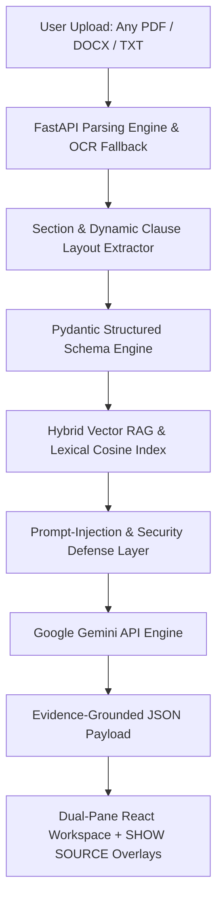

# ⚖️ NyaySetu (न्यायसेतु)
> **"Bridging Legal Complexity and Understanding for Every Citizen."**

[](https://my-project-70303.web.app)
[](https://www.python.org/)
[](https://fastapi.tiangolo.com/)
[](https://reactjs.org/)
[](https://vitejs.dev/)
[](https://tailwindcss.com/)
[]()
[]()

NyaySetu is an India-focused, GenAI-powered legal information, document intelligence, version comparison, and consultation preparation platform engineered for the **PromptWars Virtual** challenge.

---

## ⏱️ Evaluator 60-Second Quick Start

1. **Open Live App**: **[https://my-project-70303.web.app](https://my-project-70303.web.app)**
2. **Click Demo or Upload**: Click **"Rental Agreement Demo"** (or upload your own PDF/TXT contract like an NDA, Employment, or Service agreement).
3. **5-Step Core Journey**:
   - **1. UNDERSTAND**: Read clear plain-language clause explanations in **English**, **Hindi (हिंदी)**, or **Telugu (తెలుగు)**.
   - **2. WHAT MATTERS**: Review highlighted financial terms (₹/INR), critical dates, lock-in periods, and obligations.
   - **3. VERIFY**: Click **"SHOW SOURCE"** on any clause or finding to jump directly to the exact source text with a yellow highlight overlay.
   - **4. COMPARE**: Click **"Compare Versions"** tab to run dynamic side-by-side diffing between Version A and Version B.
   - **5. PREPARE**: Click **"Lawyer Consultation Prep"** to generate custom questions, missing document checklists, and export a printable PDF report.

---

## 🎯 Challenge Requirement Mapping Matrix

| Problem Statement Requirement | NyaySetu Implementation | Evaluator Verification Path |
|-------------------------------|-------------------------|-----------------------------|
| **1. UNDERSTAND** | Gemini-powered plain-language simplifications for complex legal jargon in EN, HI, and TE. | Click **"Understand Simply"** tab → Select language. |
| **2. IDENTIFY WHAT MATTERS** | Instant extraction of financial terms (INR/₹), lock-in periods, notice periods, and obligations matrix. | Check **"Overview"** & **"Your Obligations"** tabs. |
| **3. VERIFY (Evidence Traceability)** | **"SHOW SOURCE"** action button on every finding auto-scrolls to exact page and applies animated highlight. | Click **"SHOW SOURCE"** on any clause card. |
| **4. COMPARE** | Dynamic side-by-side comparison engine detecting added, removed, and modified terms with dollar/INR diffs. | Go to **"Compare Versions"** tab → Select Doc A vs Doc B. |
| **5. ASK (Grounded Q&A)** | RAG-powered Q&A with strict evidence cards. Unsupported/irrelevant questions are safely refused. | Go to **"Ask Document"** → Ask valid or unsupported question. |
| **6. PREPARE (Next Steps)** | Surfacing missing documentation, upcoming critical deadlines, and risk mitigation steps. | Check **"What to Prepare"** tab. |
| **7. CONSULT (Lawyer Prep)** | Prepares citizens for lawyer consultation with tailored questions, statutory context, and PDF report export. | Go to **"Lawyer Consultation Prep"** → Download PDF. |

---

## 🌟 Core Product Thesis: Dynamic & Grounded Legal Intelligence

NyaySetu works dynamically on **ANY uploaded legal document** (PDF, DOCX, TXT) as well as pre-loaded Indian legal benchmarks.

### **The Flagship "SHOW SOURCE" Interaction**
```
┌─────────────────┐       ┌───────────────────────┐       ┌───────────────────────┐
│  AI FINDING /   │  ──►  │   FLAGSHIP ACTION     │  ──►  │ ORIGINAL SOURCE TEXT  │
│  CLAUSE SUMMARY │       │   "SHOW SOURCE"       │       │ PAGE, CLAUSE & OVERLAY│
└─────────────────┘       └───────────────────────┘       └───────────────────────┘
```

---

## 🏛️ Real-World Indian Legal Context
NyaySetu is tailored for Indian legal realities without fabricating statutory mandates:
- **Residential Rental / Lease Agreements**: 11-month lease conventions, lock-in period forfeitures, security deposit refund terms, RWA maintenance charges.
- **Employment Contracts & NDAs**: Notice periods, non-solicit covenants, IP assignments, confidentiality obligations.
- **Service & Vendor Contracts**: Payment due terms (INR ₹), dispute jurisdiction (e.g., Courts of New Delhi/Bengaluru).
- **Statutory Aid Directories**: Links to National Legal Services Authority (NALSA), eCourts Portal, and India Code.

---

## ⚡ System Architecture & Authentic Grounded RAG Pipeline

NyaySetu implements a fully transparent, 10-step evidence-grounded RAG workflow for document Q&A:

```
UPLOAD DOCUMENT 
  ├──> 1. Clause & Paragraph Chunking
  ├──> 2. Page & Section Metadata Enrichment
  ├──> 3. TF-IDF Vocabulary & Vector Embedding Generation
  ├──> 4. Cosine Similarity Vector Retrieval & Chunk Ranking
  ├──> 5. Context Selection & XML Framing (<untrusted_document_context>)
  ├──> 6. Google Gemini LLM Generation (with fallback grounded synthesis)
  ├──> 7. Source & Page Preservation (document_id, page_number, clause)
  ├──> 8. Evidence-Grounded Answer Formatting
  ├──> 9. Refusal Guardrail ("I couldn't find sufficient information in the provided document.")
  └──> 10. Prompt-Injection Security Defense
```



---

## 🔒 Security, Privacy & Reliability Controls

- **Prompt-Injection Defense**: Documents wrapped inside `<untrusted_document_context>` XML tags with strict instruction override filters.
- **Path Traversal Protection**: Filename sanitization via `os.path.basename()`.
- **Zero Hallucination Guardrail**: Standardized refusal response (*"I couldn't find sufficient information in the provided document"*) when context is missing.
- **HTTP Security Headers**: Enforced `X-Content-Type-Options`, `X-Frame-Options`, `X-XSS-Protection`.

---

## 🚀 Setup & Local Execution

### Backend Setup (FastAPI & Python 3.11)
```bash
cd backend
python -m venv venv
venv\Scripts\activate
pip install -r requirements.txt
python -m uvicorn app.main:app --reload --port 8000
```

### Frontend Setup (React 18 & Vite)
```bash
cd frontend
npm install
npm run dev
```

---

## 🧪 Automated Testing Suite

Execute the full suite of automated tests verifying dynamic uploads, grounding, Q&A refusal, and lawyer preparation:
```bash
cd backend
python -m pytest tests/test_ai_eval.py tests/test_api.py -v
```

---

## 🌐 Deploy to Firebase
```powershell
powershell -ExecutionPolicy Bypass -File .\deploy-firebase.ps1
```

---

## ⚠️ Informational Disclaimer & AI Safety Boundary
NyaySetu provides educational document intelligence and preparation checklists. NyaySetu is **NOT a lawyer**, is **NOT a law firm**, and does **NOT provide formal legal advice or representation**.